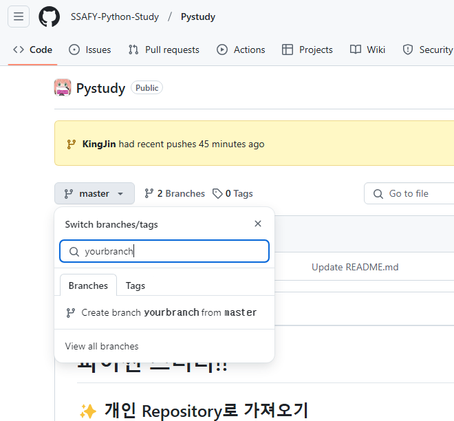
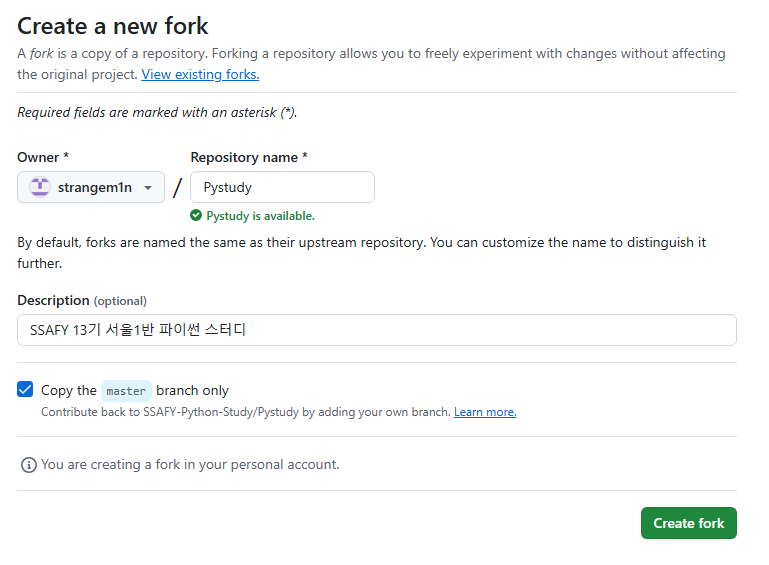
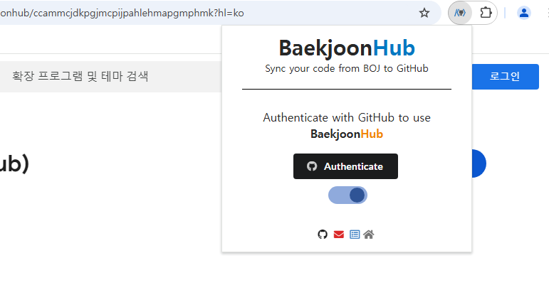
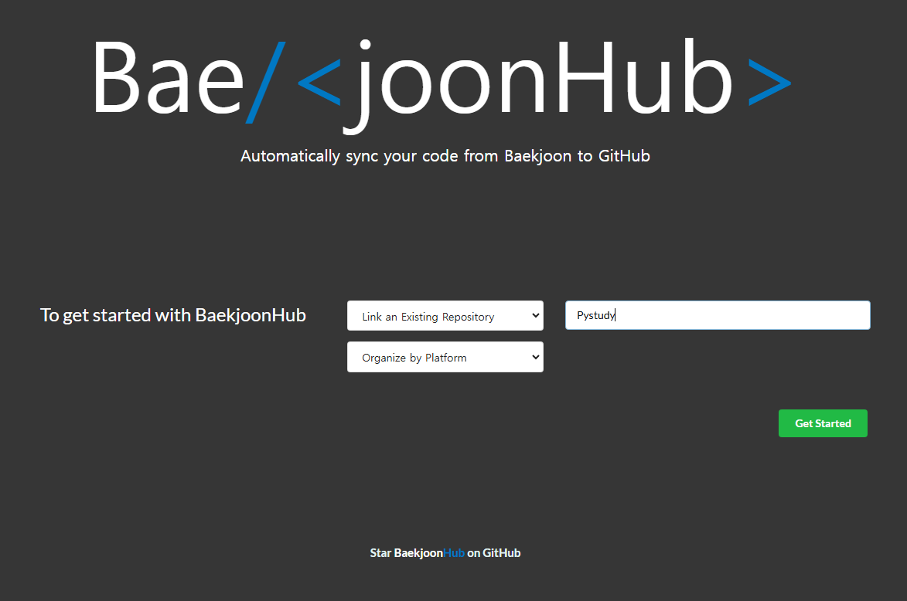
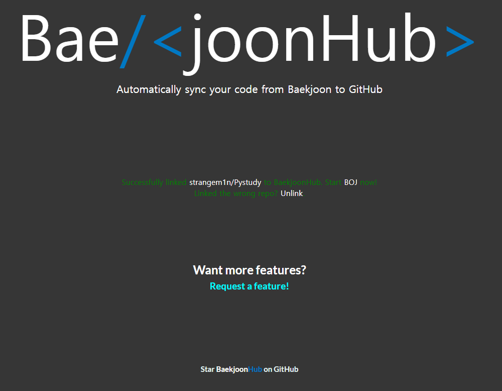
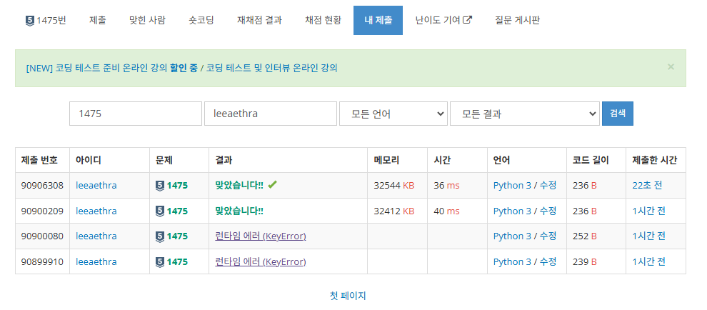
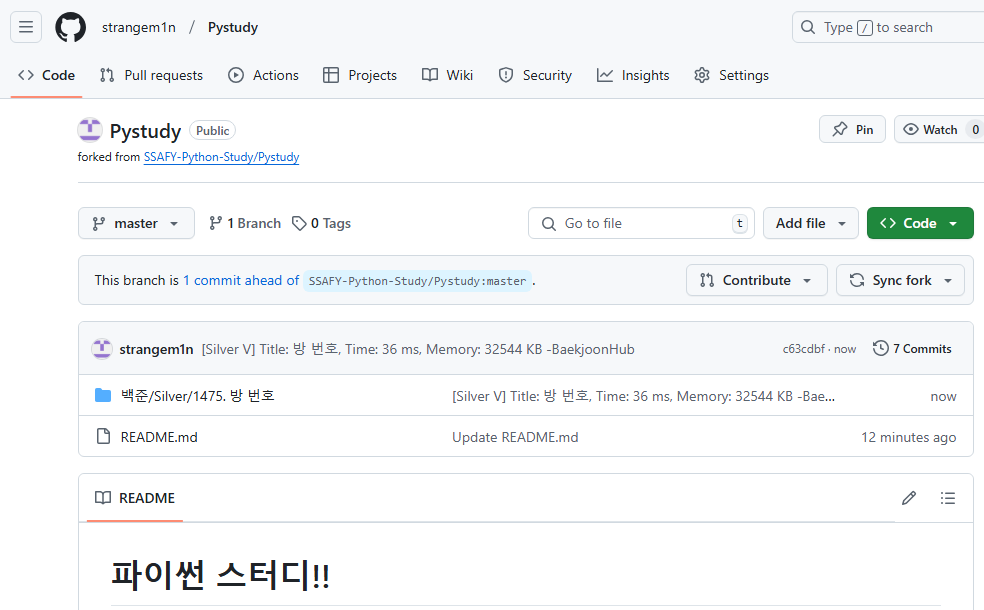
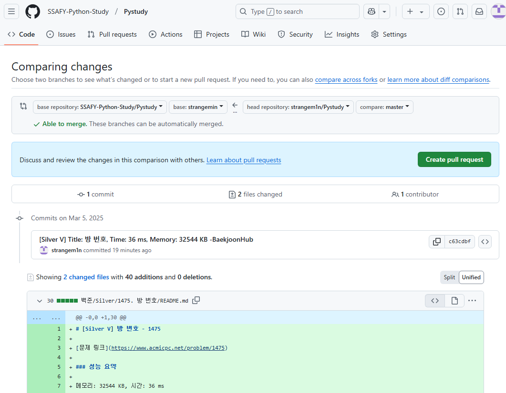
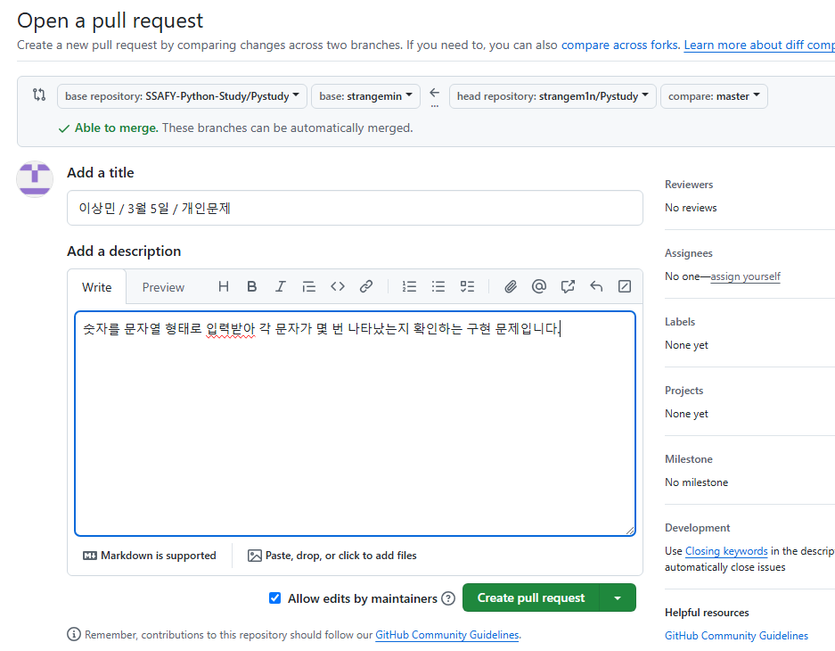
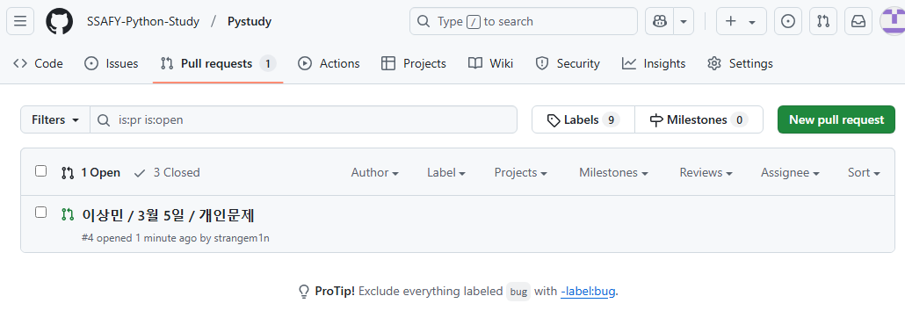

# 파이썬 스터디!!

## ✨ 개인 Repository로 가져오기
- 자신만의 branch를 먼저 만들어서 향후 커밋할 때 충돌나는 것을 방지해요.
- 기본으로 설정된 `master` 브랜치를 눌러서 텍스트박스에 원하는 이름으로 새 브랜치를 생성합니다.

- 우측 상단 `Fork` 버튼 누르기

- 개인 계정에 스터디 공용 레파지토리를 가져오는 역할을 합니다.

## 💻 크롬 확장 프로그램 설치하기
- [설치 링크](https://chromewebstore.google.com/detail/ccammcjdkpgjmcpijpahlehmapgmphmk?utm_source=item-share-cb)
- 설치가 완료되면, 퍼즐 아이콘을 눌러서 백준허브 초기 설정 창으로 들어갑니다.

- `Link an Existing Repository` 옵션을 선택한 후 위에서 fork 해서 생긴 Repository name 을 넣고 `Get Started` 버튼을 누릅니다.

- Successfully Linked 멘트가 뜨면 성공!

- 이제 백준, 프로그래머스, SWEA 등 문제를 풀고 나서 성공하면 자동으로 제출한 코드가 자신의 깃허브 레파지토리에 커밋됩니다!

## ⏫ Pull Requests (PR) 하기
- 개인 레파지토리에 올라간 문제를 저희 공용 레파지토리에 합쳐야 해요.
- 각자 계정의 스터디 레파지토리에서 Pull Requests 탭으로 들어갑니다.
- `New pull request` 버튼을 누르면 오늘 푼 문제와 코드가 대기 중으로 뜰 겁니다.
- 이 때, base를 **자신이 만든 branch로 꼭!! 설정**해 주세요.

- `Create pull request` 버튼을 눌러서 PR 제목과 내용을 작성해주세요.
### ✔️ 규칙
- PR 제목: 이름 / 날짜 / 주간 혹은 개인 문제
- 예시: `이상민 / 3월 5일 / 개인문제`
- PR 내용(Write): 자유롭게, 어떤 문제를 무슨 알고리즘을 썼는지 간단히 서술

- 이 후 공용 레파지토리로 가면 합치기 전 대기 중인 목록이 보입니다. 이러면 업로드 성공!

- 이상이 없으면 스터디장이 확인 후 병합합니다.

| 문제를 차곡차곡 쌓으면서 실력도 쑥쑥 성장합시다! |
| --- |
